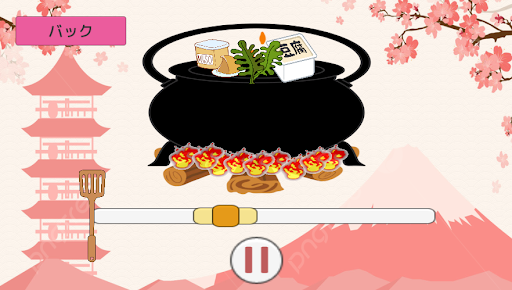
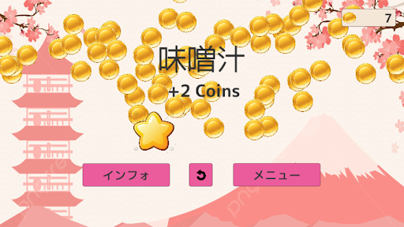

# Japanese Food Game
Simple Unity based single player cooking game that introduces various Japanese dishes and recipes through cute and relaxing minigames.  

## Table of contents
* [Gameplay](#gameplay)
* [Setup](#setup)
* [Background](#background)
* [Future Features](#future-features)

## Gameplay
The game is currently live on https://iamjennyzhao.github.io/japanese-game/

There are four main screens: 
* [Level Menu Screen](#level-menu-screen)
* [Cooking Screen](#cooking-screen)
* [End Level Screen](#end-level-screen)
* [Info Screen](#info-screen)

### Level Menu Screen 

This screen displays the different levels or foods that you can make. Your money is in the top right. To unlock new recipes, you must buy it using your money.

### Cooking Screen 

The current cooking mechanism is currently just a simple moving bar mechanic that simulates the amount of time it takes to cook the food. Press the button with the two bars to stop cooking. If you stop in the smallest section, you can get more points. 

### End Level Screen 

This screen features an explosion of coin particle effects and also reveals how much money you have made. 

### Info Screen 

If you are interested in the food and how to make it, you can access the info screen for each food. 

## Setup
Project is created with:
* Unity version: 2021.3.13f1
* Font asset: https://assetstore.unity.com/packages/2d/fonts/selected-u3d-japanese-font-337
* Music: original compositions by Pokezhang

If you would like to look at the code and update this game, feel free to. You should be able to see it if you use the correct unity version, download the font asset, and update the assets and projectsettings folders with the github files. The docs folder is Unity's WebGL build folder. 

## Background
This game was created to let new Japanese language speakers or others interested in Japanese cuisine learn about different dishes in Japan. With a simple money making system and cute gameplay, it should be an enjoyable and relaxing way to learn about new foods. Furthermore, if the player wants to know more about a specific dish, there is an recipe info screen that displays all the foods. I am creating this game as a learning project for myself. 

This game was inspired by three main games: 
* Genshin (https://static.wikia.nocookie.net/gensin-impact/images/e/ed/Kamisato_Art_Daily_Cooking_Preview.ogv/revision/latest?cb=20220406122504)
* Cooking Mama (https://youtu.be/RNp10LPsPaU?t=242)
* Overcooked (https://youtu.be/cJ2mzLk2h0c?t=2498)

## Future Features
Currently, the game only has one of the three main gameplay mechanics implemented. The other two are an ingredient gathering minigame and a heat changing minigame. 

More features to be added includes: 
* Create rules page
* English and Japanese language option
* Sound settings and sound effects
* Recipes and food information for all levels
* Ingredient customization for all levels
* UI / art revamp. (currently all art does not belong to me) 
* After unlocking all the recipes, a congratulations screen with a time of how long it took you to unlock all the recipes

As the game is currently in development, any feedback or suggestions is greatly appreciated. Email: jennywuzhao@gmail.com
